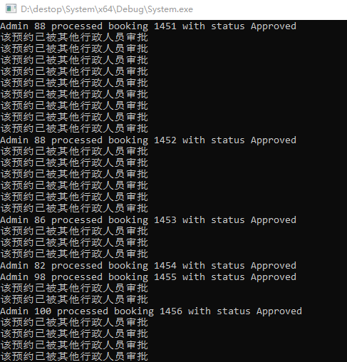

此目录存放本周课后作业，可以在此文件添加作业设计思路和流程图等

### 数据库架构
- **MeetingRooms表**：存储会议室信息，包括会议室ID、名称和容量。
- **Users表**：存储用户信息，包括用户ID、员工ID、姓名、用户名、密码和用户类型。
- **Bookings表**：存储预约信息，包括预约ID、会议室ID、用户ID、日期、时间段和状态。
- 使用的是Mysql
### 数据库表设计
- MeetingRooms和Users表通过外键与Bookings表关联，确保数据的引用完整性。例如，不能为不存在的用户创建预约或预约不存在的会议室。
- 使用 `ENUM` 类型定义了用户类型和预约状态，使得数据更加规范和易于理解。

### 系统设计

1. **用户角色**：
   - **业务人员**：可以申请预约、查看个人和所有预约、取消预约、修改密码。
   - **行政人员**：可以查看所有预约、审批或拒绝预约。
   - **管理员**：可以添加账户（业务人员和行政人员）、查看账户、查看会议室信息、清空所有预约记录、删除账户。

2. **功能实现**：
   - **数据库管理** (`DatabaseManager`)：处理数据库相关操作，包括用户管理、预约管理等。
   - **用户管理** (`User`)：管理用户信息，包括登录验证、密码修改验证。
   - **菜单系统** (`Menu` 及其子类)：根据用户角色提供不同的菜单选项和功能。
   - **菜单系统生产** (`MenuFactory` 及其子类)：根据用户角色实现具体的菜单生成。

### 代码架构

1. **数据库管理 (`DatabaseManager` 类)**：
   - 连接和操作数据库，提供增删查改功能。
   - 包括用户添加、预约的增删改查等。

类方法详细说明：

- 事务处理：beginTransaction, commitTransaction, 和 rollbackTransaction 方法提供了事务处理的能力，确保数据库操作的原子性和一致性。

- 构造函数和析构函数
- **构造函数**：在构造函数中，首先使用 `mysql_init` 初始化 MySQL 连接，然后调用 `connect` 方法来连接数据库。
- **析构函数**：确保在对象销毁时关闭数据库连接，防止内存泄漏。

- 连接数据库
 **`connect` 方法**：负责建立与 MySQL 数据库的连接。如果连接失败，抛出异常。

- 用户类型转换
 **`stringToUserType` 和 `userTypeToString` 方法**：这两个方法用于 `UserType` 枚举类型与字符串之间的转换，以便于在数据库操作和逻辑处理中使用。

- 添加用户
 **`addUser` 方法**：首先检查用户名是否已存在，然后插入新用户记录到数据库。如果用户名已存在或者数据库操作失败，返回 `false`。

- 查看用户
 **`viewUsers` 方法**：根据用户类型查询用户信息并输出。

- 查看会议室信息
 **`viewMeetingRooms` 方法**：分别查询有预订和无预订的会议室信息。

- 清空预约记录
 **`clearBookings` 方法**：删除所有预约记录。使用事务处理以确保操作的原子性。

- 删除用户
 **`deleteUser` 方法**：检查用户是否存在且非管理员，然后删除用户。管理员账户不能被删除。

- 处理关联数据
 **`handleAssociatedData` 方法**：在删除用户之前，删除该用户的所有预约记录，以维持数据一致性。

- 预约会议室
 **`bookRoom` 方法**：检查同一时间段内是否有重复预约，确保不会重复预约同一会议室。

- 检查会议室预约状态
 **`isRoomBooked` 方法**：检查特定时间段内会议室是否已被预约。

- 查看所有预约记录
 **`viewAllBookings` 方法**：显示所有预约记录的详细信息。

- 查看特定用户的预约记录
 **`viewBookingsByUser` 方法**：根据用户 ID 查询并显示该用户的所有预约记录。

- 取消预约
 **`cancelBooking` 方法**：更新特定预约记录的状态为“已取消”，在更新前检查预约记录是否存在。

- 获取待审批的预约ID
 **`getPendingBookingID` 方法**：查询状态为“待审批”的预约记录的 ID。

- 更新预约状态
 **`updateBookingStatus` 方法**：更新预约记录的状态（如“已批准”或“已拒绝”），在更新前检查预约记录的当前状态以避免重复处理。

- 获取用户信息
 **`getUserByUsernameAndPassword` 方法**：根据用户名和密码查询用户信息，用于登录验证。

- 更新密码
 **`updatePassword` 方法**：更新特定用户的密码，更新前检查用户是否存在。

2. **用户 (`User` 类)**：
   - 存储用户信息，如 ID、姓名、用户名、密码和用户类型。
   - 提供获取和设置用户信息的方法。

3. **菜单 (`Menu` 类及其子类)**：
   - 抽象基类 `Menu` 定义通用接口。
   - `BusinessMenu`、`ExecutiveMenu` 和 `AdminMenu` 分别实现具体角色的菜单和功能。

4. **菜单工厂 (`MenuFactory` 类及其子类)**：
   - 抽象基类 `MenuFactory` 定义通用接口，它包含一个用于创建 Menu 对象的方法。
   - `BusinessMenuFactory`、`ExecutiveMenuFactory` 和 `AdminMenuFactory` 分别实现具体角色的菜单生成。

5. **模拟功能**：
   - `simulateUser` 和 `simulateAdminApproving` 函数模拟用户和行政人员的行为，经测试，在高并发环境下，如多个行政人员审批同一条记录情况下，能够做到不发生同一个预约被反复多次审批的情况，保证一致性。
   
   - 使用多线程和异步编程技术 (`std::async`、`std::future`)，同时打开多个线程。

6. **日志和安全**：
   - `safeLogOutput` 函数使用互斥锁确保线程安全的日志输出。

7. **主函数 (`main`)**：
   - 初始化数据库连接。
   - 提供用户登录和菜单选择。
   - 根据用户类型展示相应菜单。

### 关键注意点

- **内存管理**：确保所有动态分配的资源（如数据库连接）在不再需要时被正确释放：所有类均已定义类析构函数。
- **异常处理**：在数据库操作和用户输入处理中加入异常处理机制。
- **线程安全**：在多线程环境下保证数据的一致性和安全。

### 扩展性和可维护性

- **模块化设计**：每个类和功能模块保持独立，易于扩展和维护。
- **代码规范**：遵循一定的编程规范和风格，提高代码的可读性。

### 单元测试gtest

对核心类DatabaseManager类进行了单元测试，已测试了除数据库异常外的其它代码

### 附加功能：
- **实现了密码修改的功能**（仅在普通用户类实现，作为示例）
- **为admin增加删除用户的功能**
- **用户菜单生成采用工厂模式** （使得创建 Menu 对象的代码与 Menu 对象的具体实现解耦，增加了灵活性，并且使得将来添加新类型的菜单变得更加容易。）